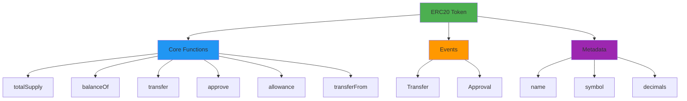
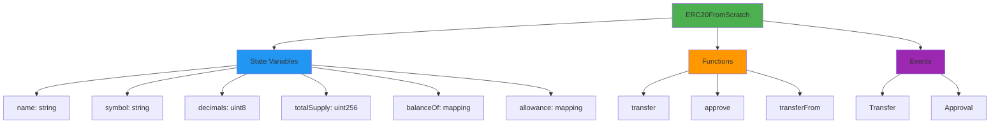
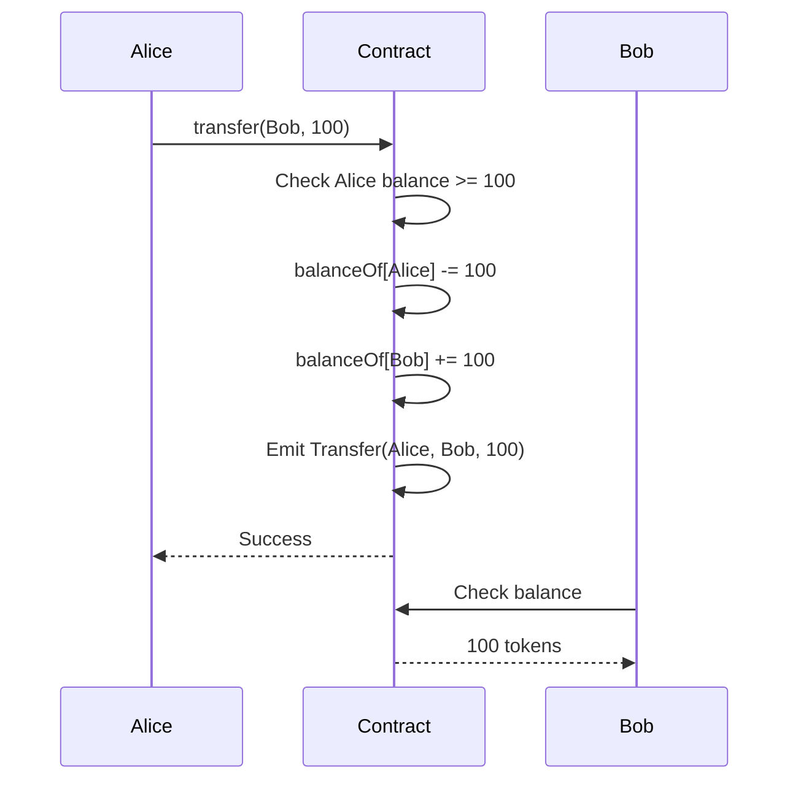
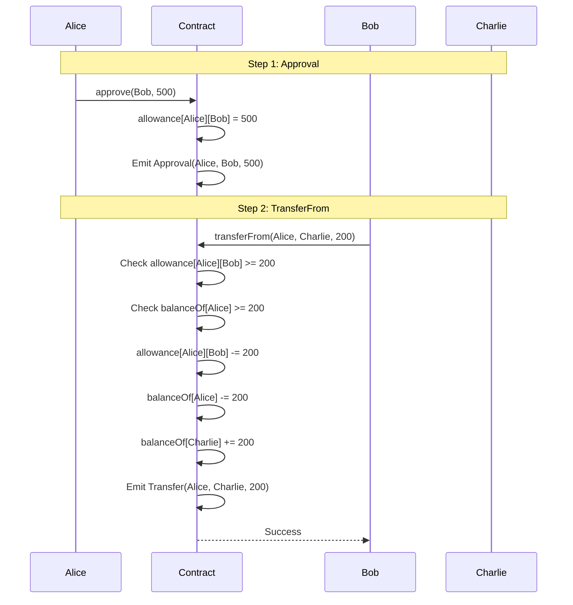
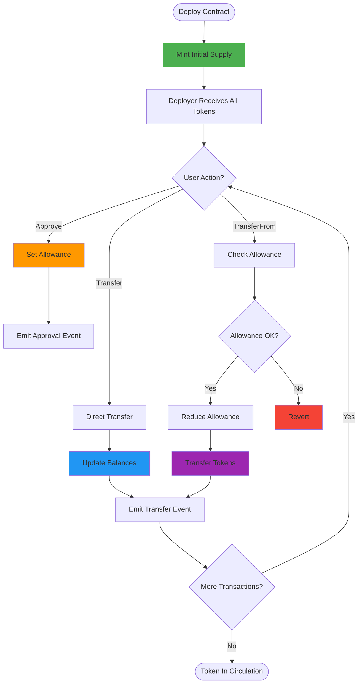
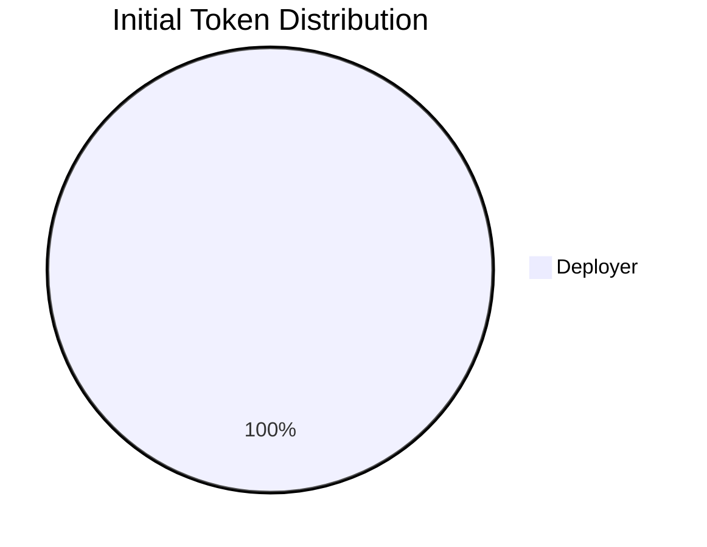

# ERC20 Token From Scratch

<div align="center">
  <a href="https://docs.soliditylang.org/en/v0.8.20/"></a>
  <a href="https://hardhat.org/"></a>
  <a href="https://opensource.org/licenses/MIT"></a>
  <a href="https://hardhat.org/hardhat-network/docs"></a>
  <a href="https://eips.ethereum.org/EIPS/eip-20"></a>
  <a href="https://ethereum.org/"></a>
</div>

<div align="center">
  <h3>A complete ERC20 token implementation built from scratch</h3>
  <p>Learn token standards by building a fungible token with transfer, approval, and allowance features</p>
  
  <br>
  
  <a href="#overview">Overview</a> •
  <a href="#features">Features</a> •
  <a href="#getting-started">Getting Started</a> •
  <a href="#deployment">Deployment</a> •
  <a href="#usage-examples">Usage</a> •
  <a href="#erc20-standard">ERC20 Standard</a> •
  <a href="#author">Author</a>
  
  <br><br>
  
  
  
  
</div>

---

## Table of Contents

- [Overview](#overview)
- [Features](#features)
- [ERC20 Standard](#erc20-standard)
- [Architecture](#architecture)
- [Workflow](#workflow)
- [Getting Started](#getting-started)
- [Contract Details](#contract-details)
- [Deployment](#deployment)
- [Usage Examples](#usage-examples)
- [Token Economics](#token-economics)
- [Use Cases](#use-cases)
- [Author](#author)

---

## Overview

This project implements the ERC20 token standard from scratch without using OpenZeppelin or any external libraries. It's a complete, educational implementation showing how fungible tokens work on Ethereum, including transfers, approvals, and allowances.

### Key Highlights

- **Pure Implementation**: No external dependencies
- **ERC20 Compliant**: Follows the standard specification
- **Educational**: Clear, commented code for learning
- **Full Featured**: Transfer, approve, transferFrom
- **18 Decimals**: Standard token precision
- **Event Logging**: Complete transaction tracking

---

## Features

| Feature | Description |
|---------|-------------|
| **Name & Symbol** | Custom token identity |
| **Decimals** | 18 decimals (like ETH) |
| **Total Supply** | Fixed supply set at deployment |
| **Transfers** | Send tokens between addresses |
| **Approvals** | Allow others to spend your tokens |
| **Allowances** | Controlled delegation of spending |
| **Events** | Transfer and Approval tracking |

---

## ERC20 Standard

### What is ERC20?

ERC20 is the most widely used token standard on Ethereum. It defines a common set of rules that all fungible tokens must follow, enabling interoperability across wallets, exchanges, and dApps.

<div align="center">



</div>

### Standard Requirements

<div align="center">

| Component | Type | Required | Purpose |
|-----------|------|----------|---------|
| `name` | string | Optional | Token name |
| `symbol` | string | Optional | Token ticker |
| `decimals` | uint8 | Optional | Decimal places |
| `totalSupply` | uint256 | Required | Total token supply |
| `balanceOf` | mapping | Required | Track balances |
| `transfer` | function | Required | Send tokens |
| `approve` | function | Required | Allow spending |
| `allowance` | mapping | Required | Track allowances |
| `transferFrom` | function | Required | Spend on behalf |

</div>

---

## Architecture

<div align="center">



</div>

### Contract Structure

```
ERC20FromScratch
├── Metadata
│   ├── name (string)
│   ├── symbol (string)
│   └── decimals (uint8)
├── State Variables
│   ├── totalSupply (uint256)
│   ├── balanceOf (mapping: address => uint256)
│   └── allowance (mapping: address => mapping(address => uint256))
├── Functions
│   ├── transfer(address, uint256)
│   ├── approve(address, uint256)
│   └── transferFrom(address, address, uint256)
└── Events
    ├── Transfer(address, address, uint256)
    └── Approval(address, address, uint256)
```

---

## Workflow

### Token Transfer Flow

<div align="center">



</div>

### Approval & TransferFrom Flow

<div align="center">



</div>

### Complete Token Lifecycle

<div align="center">



</div>

---

## Getting Started

### Prerequisites

- Node.js v16+
- npm or yarn
- Git
- Hardhat

### Installation

```bash
# Clone repository
git clone https://github.com/Siddheshwar-cloud/erc20-from-scratch.git
cd erc20-from-scratch

# Install dependencies
npm install
```

### Project Structure

```
erc20-from-scratch/
├── contracts/
│   └── ERC20FromScratch.sol
├── scripts/
│   └── deploy.js
├── hardhat.config.js
└── README.md
```

---

## Contract Details

### Constructor

```solidity
constructor(
    string memory _name,
    string memory _symbol,
    uint256 _initialSupply
)
```

**Parameters:**
- `_name`: Token name (e.g., "MyToken")
- `_symbol`: Token symbol (e.g., "MTK")
- `_initialSupply`: Initial supply without decimals (e.g., 1000000 = 1M tokens)

**Effects:**
- Sets token metadata
- Mints initial supply to deployer
- Emits Transfer event from address(0)

---

### State Variables

```solidity
string public name;                                    // Token name
string public symbol;                                  // Token symbol
uint8 public decimals = 18;                           // Decimal places
uint256 public totalSupply;                           // Total token supply
mapping(address => uint256) public balanceOf;         // User balances
mapping(address => mapping(address => uint256)) public allowance;  // Spending allowances
```

---

### Functions

#### transfer()

```solidity
function transfer(address _to, uint256 _value) external returns (bool)
```

Transfer tokens to another address.

**Parameters:**
- `_to`: Recipient address
- `_value`: Amount to transfer (in token units)

**Requirements:**
- `_to` must not be zero address
- Sender must have sufficient balance

**Returns:** `true` on success

**Example:**
```javascript
await token.transfer(recipientAddress, ethers.parseUnits("100", 18));
```

---

#### approve()

```solidity
function approve(address _spender, uint256 _value) external returns (bool)
```

Allow another address to spend your tokens.

**Parameters:**
- `_spender`: Address allowed to spend
- `_value`: Maximum amount they can spend

**Requirements:**
- `_spender` must not be zero address

**Returns:** `true` on success

**Example:**
```javascript
await token.approve(spenderAddress, ethers.parseUnits("500", 18));
```

---

#### transferFrom()

```solidity
function transferFrom(
    address _from,
    address _to,
    uint256 _value
) external returns (bool)
```

Transfer tokens on behalf of another address (requires prior approval).

**Parameters:**
- `_from`: Address to transfer from
- `_to`: Address to transfer to
- `_value`: Amount to transfer

**Requirements:**
- `_to` must not be zero address
- `_from` must have sufficient balance
- Caller must have sufficient allowance

**Returns:** `true` on success

**Example:**
```javascript
await token.connect(spender).transferFrom(ownerAddress, recipientAddress, ethers.parseUnits("100", 18));
```

---

### Events

#### Transfer

```solidity
event Transfer(address indexed from, address indexed to, uint256 value)
```

Emitted when tokens are transferred.

**Parameters:**
- `from`: Sender address (address(0) for minting)
- `to`: Recipient address
- `value`: Amount transferred

---

#### Approval

```solidity
event Approval(address indexed owner, address indexed spender, uint256 value)
```

Emitted when allowance is set.

**Parameters:**
- `owner`: Token owner
- `spender`: Approved spender
- `value`: Approved amount

---

## Deployment

### Local Network

```bash
# Terminal 1: Start node
npx hardhat node

# Terminal 2: Deploy
npx hardhat run scripts/deploy.js --network localhost
```

### Deployment Configuration

Default deployment parameters in `deploy.js`:

```javascript
const name = "MyToken";
const symbol = "MTK";
const initialSupply = 1_000_000;  // 1 million tokens
```

Modify these before deployment as needed.

### Deployment Output

```
ERC20 deployed to: 0x5FbDB2315678afecb367f032d93F642f64180aa3
```

---

## Usage Examples

### Basic Token Operations

```javascript
const { ethers } = require("hardhat");

async function main() {
  // Deploy
  const Token = await ethers.getContractFactory("ERC20FromScratch");
  const token = await Token.deploy("MyToken", "MTK", 1_000_000);
  await token.waitForDeployment();
  
  const [owner, user1, user2] = await ethers.getSigners();
  
  console.log("Token deployed to:", await token.getAddress());
  
  // Check initial balance
  const ownerBalance = await token.balanceOf(owner.address);
  console.log("Owner balance:", ethers.formatUnits(ownerBalance, 18));
  
  // Transfer to user1
  await token.transfer(user1.address, ethers.parseUnits("1000", 18));
  console.log("Transferred 1000 tokens to user1");
  
  // Check balances
  const user1Balance = await token.balanceOf(user1.address);
  console.log("User1 balance:", ethers.formatUnits(user1Balance, 18));
}

main();
```

---

### Approval & TransferFrom Example

```javascript
async function approvalExample() {
  const Token = await ethers.getContractFactory("ERC20FromScratch");
  const token = await Token.deploy("MyToken", "MTK", 1_000_000);
  await token.waitForDeployment();
  
  const [owner, spender, recipient] = await ethers.getSigners();
  
  // Owner approves spender to spend 500 tokens
  console.log("Owner approving spender...");
  await token.approve(spender.address, ethers.parseUnits("500", 18));
  
  // Check allowance
  const allowance = await token.allowance(owner.address, spender.address);
  console.log("Allowance:", ethers.formatUnits(allowance, 18));
  
  // Spender transfers 200 tokens from owner to recipient
  console.log("Spender executing transferFrom...");
  await token.connect(spender).transferFrom(
    owner.address,
    recipient.address,
    ethers.parseUnits("200", 18)
  );
  
  // Check balances
  const recipientBalance = await token.balanceOf(recipient.address);
  console.log("Recipient balance:", ethers.formatUnits(recipientBalance, 18));
  
  // Check remaining allowance
  const remainingAllowance = await token.allowance(owner.address, spender.address);
  console.log("Remaining allowance:", ethers.formatUnits(remainingAllowance, 18));
}

approvalExample();
```

---

### Token Information Query

```javascript
async function tokenInfo(tokenAddress) {
  const token = await ethers.getContractAt("ERC20FromScratch", tokenAddress);
  
  const name = await token.name();
  const symbol = await token.symbol();
  const decimals = await token.decimals();
  const totalSupply = await token.totalSupply();
  
  console.log("\n=== Token Information ===");
  console.log("Name:", name);
  console.log("Symbol:", symbol);
  console.log("Decimals:", decimals);
  console.log("Total Supply:", ethers.formatUnits(totalSupply, decimals));
}

tokenInfo("0x5FbDB2315678afecb367f032d93F642f64180aa3");
```

---

### Event Monitoring

```javascript
async function monitorEvents() {
  const token = await ethers.getContractAt(
    "ERC20FromScratch",
    "YOUR_TOKEN_ADDRESS"
  );
  
  // Listen for transfers
  token.on("Transfer", (from, to, value) => {
    console.log("\n💸 Transfer Event:");
    console.log("From:", from);
    console.log("To:", to);
    console.log("Value:", ethers.formatUnits(value, 18));
  });
  
  // Listen for approvals
  token.on("Approval", (owner, spender, value) => {
    console.log("\n✅ Approval Event:");
    console.log("Owner:", owner);
    console.log("Spender:", spender);
    console.log("Value:", ethers.formatUnits(value, 18));
  });
  
  console.log("Monitoring events... Press Ctrl+C to stop");
}

monitorEvents();
```

---

### Multiple Transfers Example

```javascript
async function distributionExample() {
  const Token = await ethers.getContractFactory("ERC20FromScratch");
  const token = await Token.deploy("MyToken", "MTK", 10_000_000);
  await token.waitForDeployment();
  
  const [owner] = await ethers.getSigners();
  
  // Recipients and amounts
  const recipients = [
    { address: "0x70997970C51812dc3A010C7d01b50e0d17dc79C8", amount: "10000" },
    { address: "0x3C44CdDdB6a900fa2b585dd299e03d12FA4293BC", amount: "20000" },
    { address: "0x90F79bf6EB2c4f870365E785982E1f101E93b906", amount: "30000" }
  ];
  
  console.log("Distributing tokens...\n");
  
  for (const recipient of recipients) {
    await token.transfer(
      recipient.address,
      ethers.parseUnits(recipient.amount, 18)
    );
    console.log(`Sent ${recipient.amount} tokens to ${recipient.address}`);
  }
  
  console.log("\nDistribution complete!");
}

distributionExample();
```

---

## Token Economics

### Understanding Decimals

```javascript
// With 18 decimals:
1 token = 1,000,000,000,000,000,000 smallest units (wei-like)

// Examples:
1.5 tokens = 1,500,000,000,000,000,000 units
0.1 tokens = 100,000,000,000,000,000 units
```

### Supply Calculation

```solidity
// If initialSupply = 1,000,000 and decimals = 18:
totalSupply = 1,000,000 * (10 ** 18)
            = 1,000,000,000,000,000,000,000,000 smallest units
            = 1,000,000 tokens
```

### Token Distribution

<div align="center">



</div>

After deployment, all tokens belong to the deployer who can then distribute them.

---

## Use Cases

### 1. Cryptocurrency / Payment Token

Create your own cryptocurrency for payments within an ecosystem.

```javascript
// Deploy payment token
const PayToken = await Token.deploy("PayToken", "PAY", 1_000_000_000);
```

---

### 2. Governance Token

Tokens representing voting power in a DAO.

```javascript
// Deploy governance token
const GovToken = await Token.deploy("Governance Token", "GOV", 10_000_000);

// Distribute to DAO members
await govToken.transfer(member1, ethers.parseUnits("1000", 18));
```

---

### 3. Reward Token

Issue tokens as rewards for user activities.

```javascript
// Reward system
async function rewardUser(userAddress, activityPoints) {
  const rewardAmount = activityPoints * 10; // 10 tokens per point
  await rewardToken.transfer(userAddress, ethers.parseUnits(rewardAmount.toString(), 18));
}
```

---

### 4. Utility Token

Access token for platform features or services.

```javascript
// Check if user has enough tokens to access premium feature
const userBalance = await utilityToken.balanceOf(userAddress);
const requiredBalance = ethers.parseUnits("100", 18);

if (userBalance >= requiredBalance) {
  // Grant access to premium feature
}
```

---

### 5. Stablecoin (with additional features)

Base ERC20 for building a stablecoin (would need price oracle integration).

---

## ERC20 vs Other Standards

<div align="center">

| Standard | Type | Use Case |
|----------|------|----------|
| **ERC20** | Fungible | Currencies, tokens |
| **ERC721** | Non-Fungible | NFTs, unique items |
| **ERC1155** | Multi-Token | Gaming, mixed assets |

</div>

---

## Security Considerations

### Implemented Protections

1. **Zero Address Check**: Prevents transfers to/from address(0)
2. **Balance Validation**: Ensures sufficient balance before transfer
3. **Allowance Validation**: Checks allowance before transferFrom
4. **Integer Overflow**: Solidity 0.8.20 has built-in protection

### Best Practices

- Always check return values when calling ERC20 functions
- Use `approve(0)` before changing allowance to prevent race conditions
- Never send tokens to contract addresses without verification
- Monitor large transfers and approvals

---

## Common Patterns

### Safe Approval Pattern

```javascript
// Reset allowance to 0 first, then set new allowance
await token.approve(spender, 0);
await token.approve(spender, newAmount);
```

### Batch Transfer Pattern

```javascript
async function batchTransfer(recipients, amounts) {
  for (let i = 0; i < recipients.length; i++) {
    await token.transfer(recipients[i], amounts[i]);
  }
}
```

---

## Troubleshooting

**"Insufficient balance"**
- Check sender's balance with `balanceOf()`
- Ensure amount includes correct decimals

**"Allowance exceeded"**
- Check allowance with `allowance(owner, spender)`
- Owner must call `approve()` first

**"Invalid address"**
- Don't send to address(0)
- Verify address format

---

## FAQ

**Q: Can I mint more tokens after deployment?**
A: No, this implementation has fixed supply. Add mint function if needed.

**Q: How do I add my token to MetaMask?**
A: Use "Import Token" with the contract address.

**Q: Why 18 decimals?**
A: Standard practice, matches ETH. Allows fractional tokens.

**Q: Can I burn tokens?**
A: Not in this implementation. Can add burn function or send to address(0).

**Q: Is this production-ready?**
A: It's educational. For production, consider audited libraries like OpenZeppelin.

---

## Technology Stack

| Technology | Version | Purpose |
|------------|---------|---------|
| Solidity | ^0.8.20 | Contract language |
| Hardhat | Latest | Development |
| Ethers.js | v6 | Interactions |
| Node.js | v16+ | Runtime |

---

## Author

<div align="center">
  
  
  
  
</div>

<br>

<div align="center">
  
</div>

<br>

<table align="center">
  <tr>
    <td align="center" width="200">
      
      <br><strong>GitHub</strong>
      <br><a href="https://github.com/Siddheshwar-cloud">@Siddheshwar-cloud</a>
    </td>
    <td align="center" width="200">
      
      <br><strong>LinkedIn</strong>
      <br><a href="https://www.linkedin.com/in/sidheshwar-yengudle-113882241/">Connect</a>
    </td>
    <td align="center" width="200">
      
      <br><strong>Twitter</strong>
      <br><a href="https://x.com/SYangudale">@SYangudale</a>
    </td>
  </tr>
</table>

<div align="center">
  
  <br>
  
  [](https://github.com/Siddheshwar-cloud)
  [](https://www.linkedin.com/in/sidheshwar-yengudle-113882241/)
  [](https://x.com/SYangudale)

</div>

<br>

<div align="center">

### Skills & Expertise


</div>

---

## Show Your Support

<div align="center">
  
[](https://github.com/Siddheshwar-cloud/erc20-from-scratch)

<a href="https://github.com/Siddheshwar-cloud/erc20-from-scratch/stargazers">
  
</a>

**Your star helps others learn ERC20 token development!**

</div>

### Repository Links

<div align="center">

[](https://github.com/Siddheshwar-cloud/erc20-from-scratch)
[](https://github.com/Siddheshwar-cloud/erc20-from-scratch/fork)
[](https://github.com/Siddheshwar-cloud/erc20-from-scratch/issues)
[](https://github.com/Siddheshwar-cloud/erc20-from-scratch/pulls)

</div>

---

## Contributing

Enhancements ideas:
- Add mint/burn functions
- Implement pausable transfers
- Add access control (Ownable)
- Create token vesting schedules
- Add snapshot functionality

---

## License

MIT License - see [LICENSE](LICENSE) file

```
Copyright (c) 2024 Sidheshwar Yengudle
```

---

<div align="center">
  <p>Made with dedication to blockchain education</p>
  <p>Deployed on Local Hardhat Network</p>
  
  <br>
  
  
  
  
  
  <br><br>
  
  **Build Tokens, Power DeFi!**
  
  <br>
  
  <a href="https://github.com/Siddheshwar-cloud/erc20-from-scratch">
    <img src="https://img.shields.io/badge/⬆️_Back_to_Top-100000?style=for-the-badge&logo
